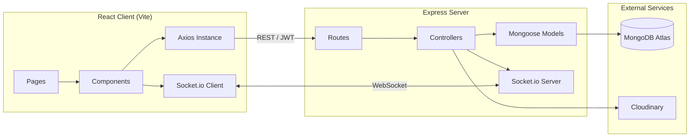

<div align="center">


<br/>


</div>

---

## 📖 About

**ConnectSphere** is a full-stack social media platform built as a capstone MERN project. It extends a REST API into a complete, production-style social app — JWT authentication, image uploads, a follow/feed system, live Socket.io notifications, and a polished React frontend with a glassmorphism, dark space-themed UI.

No UI component libraries were used — every surface, animation, and interaction (glass cards, the particle/planet background, the like-button pop, the notification bell) is hand-built in plain CSS Modules.

---

## ✨ Features

| Category | What it does |
|---|---|
| 🔐 **Authentication** | JWT-based register/login, bcrypt password hashing, protected routes enforced server-side |
| 👤 **Profiles** | Avatar & cover photo upload, bio editing, follower/following lists in a modal |
| 📝 **Posts** | Create/edit/delete with optional image upload, tags, ownership enforced server-side |
| 🧭 **Feed vs. Explore** | Feed shows only followed users + own posts; Explore shows everyone, paginated |
| ❤️ **Likes & Comments** | Optimistic UI updates, ownership-aware comment deletion (author or post owner) |
| 🔔 **Real-time Notifications** | Socket.io pushes live like/comment/follow events; persisted history via REST |
| 🔍 **Search** | Debounced live user search by name |
| 🎨 **UI** | Glassmorphism throughout, animated space background (parallax starfield + drifting planets), fully responsive |

---

## 🛠️ Tech Stack

| Layer | Technology | Purpose |
|---|---|---|
| **Frontend** | React (Vite) | SPA framework |
| | React Router | Client-side routing |
| | Context API | Global auth & socket state |
| | Axios | HTTP client with JWT interceptor |
| | Socket.io-client | Real-time notification stream |
| | CSS Modules | Scoped styling — no UI libraries |
| **Backend** | Node.js + Express | REST API server |
| | MongoDB + Mongoose | Database & schema modeling |
| | JWT (jsonwebtoken) | Stateless authentication |
| | bcryptjs | Password hashing |
| | Multer + Cloudinary | Image upload & hosting |
| | Socket.io | Real-time server-to-client events |
| **Dev Tools** | Nodemon | Backend auto-restart |
| | Concurrently | Run client + server with one command |
| | Postman | API testing & collection export |

---

## 🏗️ Architecture



---

## 📂 Project Structure

```
connectsphere/
├── server/
│   ├── config/          # DB + Cloudinary config
│   ├── models/          # User, Post, Comment, Notification
│   ├── routes/          # Express route definitions
│   ├── controllers/     # Business logic
│   ├── middleware/      # auth, upload, error handling
│   ├── socket/          # Socket.io notification handler
│   └── server.js        # Entry point
└── client/
    └── src/
        ├── api/          # Axios instance
        ├── context/      # AuthContext, SocketContext
        ├── hooks/        # useAuth, useNotifications
        ├── components/   # Navbar, PostCard, FollowButton, etc.
        └── pages/        # Login, Feed, Explore, Profile, PostDetail
```

---

## 🚀 Getting Started

### Prerequisites
- Node.js (LTS)
- MongoDB Atlas account
- Cloudinary account

### 1. Clone the repo
```bash
git clone https://github.com/mohsinshah12309/connectsphere.git
cd connectsphere
```

### 2. Install dependencies
```bash
# Root (for running both together)
npm install

# Server
cd server && npm install

# Client
cd ../client && npm install
```

### 3. Configure environment variables
Copy the example files and fill in your own values:
```bash
cp server/.env.example server/.env
```
Then set `MONGODB_URI`, `JWT_SECRET`, and your `CLOUDINARY_*` keys in `server/.env`.

### 4. Run the app
```bash
# From the project root — runs client + server together
npm run dev
```
- Backend: `http://localhost:5000`
- Frontend: `http://localhost:5173`

---

## 📡 API Overview

| Resource | Base Route |
|---|---|
| Auth | `/api/auth` |
| Users | `/api/users` |
| Posts | `/api/posts` |
| Comments | `/api/comments` |
| Notifications | `/api/notifications` |

All responses follow a consistent shape:
```json
{ "success": true, "message": "...", "data": { } }
```

A full Postman collection is included in the repo for testing every endpoint.

---

## 📸 Screenshots

> _Add screenshots of the Feed, Profile, and Explore pages here once the app is deployed — drag images into this section on GitHub and they'll auto-embed._

<!--


-->

---

## 👤 Author

**Muhammad Mohsin Ali Shah**
BS Software Engineering, FAST-NUCES (CFD Campus)

- GitHub: [@mohsinshah12309](https://github.com/mohsinshah12309)
- LinkedIn: [mohsin-alishah-96b0302b6](https://linkedin.com/in/mohsin-alishah-96b0302b6)

---

<div align="center">


</div>
